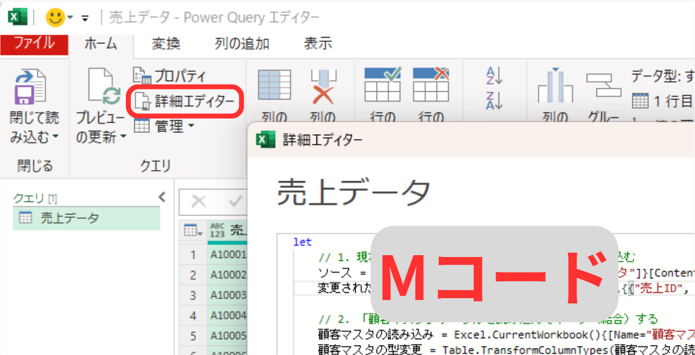

こんにちは、e-Shikumi-Laboの シン です。

このブログでは、日々の現場での気づきから得た「仕組み化思考」について公開しています。

今回は、Excel VBAの現場で感じた、AIを活用してツールを飼い慣らすための「言語化力」と「知識」の重要性についてお話しします。

---

#### VBA経験者にとっての「Power Query」の壁

現場で扱っている1万行以上あるシステムからの出力データを2つ組み合わせて、並べ替えるという作業を自動化するツールを検討していました。
これまでであれば、VBAを使い、出力データを一つのシートに張り付けたうえで、新しいフォーマット（並べ替え）にVlookup関数で張り付けていくようなコードを書いていたと思います。

しかし、データ数が膨大で処理に時間がかかることや、Excel関数をVBAの中で使用することによるエラーが気になったため、今回はExcelに標準で備わっている「Power Query」を使うことを検討しました。

Power Queryを全く触ったことがないわけではありませんでしたが、今回のように2つのファイルを1つにまとめてデータを並べ替えるような複雑なクエリは作ったことがありませんでした。

そこで、AIに「Power Queryでxxxを並べ替えする方法を教えて」と聞いてみました。

すると、Power Queryの開き方から操作の手順まで出力されたのですが、GUI（画面のボタン操作）をテキストベースで説明されても非常にわかりにくく、挫折しかけました。
（さらに、AIに聞くと様々なバージョンのPower Queryの情報を引っ張ってくるため、メニューの名称や並び順が違っていることも多く、確認がしんどいのです）

正直、「これならVBAでやってしまおうか……」と思ってしまいました。

しかし、ここで「**Mコード**」の存在を思い出しました。

---

#### 鍵を握るのは「Mコード」という言葉を知っているか

「Mコード（Power Query M 数式言語）」とは、Power Queryの裏側で実際に動いているプログラム言語のことです。この「Mコード」という存在（知識）を知っていれば、ChatGPTやGeminiなどのAIに対して、以下のような指示を出すことができます。

> 「Power Queryでxxxを並べ替えする方法を教えて。この処理を行うための**Mコード**を書いて」

この「Mコード」というキーワードを知っていることと、その使い方（どこに貼り付ければ良いか）を知っているだけで、複雑なPower Queryの作成が劇的に簡単になりました。

出力されたMコードの全文を完璧に理解できていなくても、「Mコードの存在」と「その反映方法」がわかっていれば、簡単に実装することができます。

反映方法といっても、VBA経験者なら一瞬でイメージできるはずです。VBAでいう**「VBEを開いて標準モジュールにコードを貼り付ける」のと全く同じ感覚**だからです。

具体的には、Excelの「データ」タブから**「空のクエリ」**を開き、画面上部の**「詳細エディター」**というコードウィンドウに、AIが書き出したMコードをそのまま上書きで貼り付ける。これだけです。

 

GUIのボタンをカチカチと探す必要は一切ありません。文字通り「コードをコピペするだけ」で、AIが作った複雑なデータ処理が一瞬でExcelに組み込まれます。

さらに、新たな条件を追加したければ「このMコードの○というステップの前に、△という処理を追加したコードを作成して」と指示するだけで、ツールをすぐに改善しコントロールし続けることができます。

---

#### 知識と言語化能力次第で、やれることは劇的に増える

以前のコラムでもお話ししましたが、AI時代においては「自分は何を知りたくて、どう処理したいのか」を明確に言語化できなければ、AIにまともな指示を出すことすらできません。

🔗 **[関連記事](/architecture/20260612_can-you-use-ai-without-spec)システムの理解を放棄した人が、AIにまともな仕事を頼めるわけがない**

業務の流れを「入力・処理・出力」に分解して解像度を上げる『仕組み化思考』に加えて、今回のような**「裏側で動いている仕組みの名前（Mコードなど）を知っている」という知識の引き出し**が、AIを使いこなすための強力なフックになります。

深いプログラミング言語の構文をイチから書けなくても、「知識があること」と「やりたいことの言語化能力」さえあれば、自分で作れる仕組みの幅は劇的に増えていきます。

ルールやシステムに振り回される側になるか、それとも中身を理解して飼い慣らす側になるか。
自分でコントロールできる仕組みを作る第一歩として、ぜひあなたの業務でもAIを味方につけたアプローチを試してみてください。
