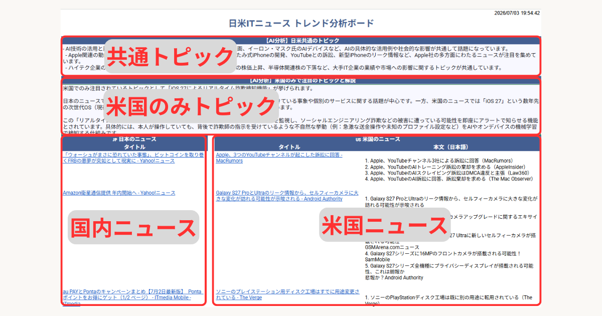

こんにちは、e-Shikumi-Laboのシンです。 このブログでは、スプレッドシート＆GASやChrome拡張機能をはじめとする、自動化のTipsを紹介しています。

前回は、「日米ITトレンドボード」の自動化のうち、データ取得部（IMPORTFEED関数）の自動化について検討しました。今回は、トピックス整理・要約部の自動化について考えていきます！

### Gemini関数の限界

前々回で紹介した通り、私はGoogle Workspaceの「Business Standardプラン」を利用しているため、スプレッドシート上で直接AIを呼び出せる「Gemini関数（AI関数）」を使用して、トピックスの整理・要約部を作成しました。

しかし、その方法には限界があります。それは**Gemini関数が自動更新できない**という関数の仕様です。

せっかく、前回データ取得部は自動更新できるようになったのに、これでは要約・整理部分は自動化できません。画面を閉じている間も裏側で勝手に要約してもらうには、関数を諦めてGAS（Google Apps Script）からAPI経由でAIを動かすしかありません。

### Gemini APIの利用を検討したが……立ちはだかる2026年の罠

プログラムからAIを呼び出すため、Geminiのおすすめに従い、最初は「完全無料枠がある」と言われているGemini APIを使う方向で検証を進めていました。しかし、実際に2026年現在のAI StudioでAPIキーを取得し、テストしている時、軽量モデルの「gemini-2.5-flash-lite」であっても、1日最大「20回」しか使えないということが判明しました。
（AIにさらっとゴメンナサイと言われ茫然自失・・・。たとえ同じGoogleであっても平気で堂々と嘘をいうので注意が必要です。そうはいっても、全部を検証できるわけではないですが・・・）

正直、これでは使い物になりません。

* 引用元（Google AI for Developers）：[レート制限について（Rate Limits）](https://ai.google.dev/gemini-api/docs/rate-limits)

### 【結論】有料枠にするなら、圧倒的に「OpenAI API」の方が安全

「1日20回の制限」を外すには、クレジットカードを登録して有料枠（従量課金）へ移行するしかありません。軽量モデルであれば「100万文字処理して数円〜数十円」レベルと激安ですが、ここで私はGeminiを捨ててOpenAI（ChatGPT）のAPIへ切り替える決断をしました。 理由は、API利用で最も恐ろしい「無尽蔵課金リスク」が全く違うからです。

- **Gemini（Google Cloud紐付け）：** 有料枠にするにはGoogle Cloudの請求アカウントと連動させる必要がありますが、基本が「後払い」のため、もしGASのコードが暴走したりAPIキーが漏れてしまった場合、数万円単位の恐ろしい請求が来るリスクが付きまといます。
    
- **OpenAI API：** こちらは「プリペイド（前払いチャージ）式」です。アカウントに「最低額の5ドル（約800円）」だけを手動でチャージし、**自動チャージ（Auto-recharge）をオフ**にして使えば、万が一コードが無限ループを起こしても、5ドルが使い果たされた瞬間に物理的にアクセスが遮断されます。

過去に取得したOpenAIのAPIキーが手元に残っていることもあり、この安全性を最優先してOpenAIの `gpt-4o-mini` モデルで一気に実装することにしました。

* 引用元（OpenAI API）：[API Pricing 2026](https://developers.openai.com/api/docs/pricing)

### OpenAI APIを使ったGASコードのサンプル

OpenAI APIを叩くための本番用GASコードです。

今回は以下のような役割分担にしています。

- **プロンプトはすべて「セル」で管理（関数で自動結合）** GASのコード内には、AIへの指示を記載していません。スプレッドシートのセル側（「元データ」シートのK列）に、関数を使って「依頼文（プロンプトの骨組み）」と「ソースとなる日米のニュース内容」をガッチャンコとつなげた文字列を用意しておき、GASはそれをただAIに届けるだけの役に徹しています。こうすることで、AIへの問い方の微調整がシート上で完結します。
    
- **取得したAPIキーは「スクリプトプロパティ」に格納** スプレッドシートの「拡張機能」＞「Apps Script」の設定（歯車マーク）にある「スクリプトプロパティ」を利用します。ここにプロパティ名 `OPENAI_API_KEY` として保存して安全に呼び出すことで、コード内に大事なキーを直書きするリスクを避けています。

```javascript
function refresh_summary(){
  var motosheet = SpreadsheetApp.getActiveSpreadsheet().getSheetByName("元データ");
  var outsheet = SpreadsheetApp.getActiveSpreadsheet().getSheetByName("ITニュース分析");

  //fromrange:プロンプトが入力されているセル
  //torange:AIの回答の出力先
  var targetList = [
    { fromrange: "K5", torange: "B5" },  // 1つ目のプロンプトと出力セル
    { fromrange: "K9", torange: "B9" }   // 2つ目のプロンプトと出力セル
  ];

  // targetListの要素を1つずつ順番に処理する
  targetList.forEach(function(target) {
    // 1. 元データシートからプロンプト（AIへの指示）を取得
    var prompt = motosheet.getRange(target.fromrange).getValue();
    
    // セルが空でない場合のみAI処理を実行
    if (prompt) {
      Logger.log(`${target.fromrange} のプロンプトを送信中...`);
      
      // 2. 別関数にプロンプトを渡して、AIの回答のみを受け取る
      var aiResponse = askOpenAI(prompt);
      
      // 3. ITニュース分析シートの指定セルにAIの回答を書き込む
      outsheet.getRange(target.torange).setValue(aiResponse);
      
      Logger.log(`${target.torange} への書き込みが完了しました。`);
    } else {
      Logger.log(`${target.fromrange} が空欄のため、スキップしました。`);
    }
  });
}

/**
 * OpenAI APIを呼び出し、AIの回答テキストのみを返す関数
 * 入力：プロンプト（文字列）
 * 出力：AIの回答（文字列）
 */
function askOpenAI(prompt) {
  // スクリプトプロパティからOpenAIのAPIキーを取得
  const apiKey = PropertiesService.getScriptProperties().getProperty('OPENAI_API_KEY');
  
  if (!apiKey) {
    return '【エラー】スクリプトプロパティに OPENAI_API_KEY が設定されていません。';
  }
  
  const apiUrl = 'https://api.openai.com/v1/chat/completions';
  
  // ペイロードの設定（モデルは gpt-4o-mini）
  const payload = {
    model: 'gpt-4o-mini',
    messages: [
      { role: 'user', content: prompt } // 引数で受け取ったプロンプトを設定
    ],
    temperature: 0.3
  };
  
  const options = {
    method: 'post',
    headers: {
      'Authorization': `Bearer ${apiKey}`,
      'Content-Type': 'application/json'
    },
    payload: JSON.stringify(payload),
    muteHttpExceptions: true // エラー時も挙動を止めずに詳細を取得する
  };
  
  try {
    const response = UrlFetchApp.fetch(apiUrl, options);
    const resCode = response.getResponseCode();
    const resText = response.getContentText();
    
    if (resCode === 200) {
      const json = JSON.parse(resText);
      // AIの回答テキストのみを抽出して返す
      return json.choices[0].message.content.trim();
    } else {
      Logger.log(`【APIエラー詳細】: ${resText}`);
      return `【APIエラー: ステータスコード ${resCode}】`;
    }
    
  } catch (e) {
    Logger.log(`【通信エラー詳細】: ${e.message}`);
    return `【通信エラーが発生しました】`;
  }
}
````

### 完成したもの

完成したものがこちらです。見た目は変わっていませんが、前回紹介したGASのトリガー機能を使って2時間ごとに自動更新しています。
 
 
 
🔗 <a href="https://docs.google.com/spreadsheets/d/e/2PACX-1vSMWZ0PusHKth0_KQmm2EBDywKJhFufqG0pm-2szrw-6c9bdH_QuKLizvxf3f_JA2hI68pKv_LSeLGa/pubhtml?gid=0&single=true" target="_blank" rel="noopener noreferrer">実際の公開ページはこちら</a>

### まとめ

今回は、画面を閉じると眠ってしまう「Gemini関数」の限界を突破するためにGASでの自動化を試みましたが、最終的には無料枠の制限の厳しさと暴走時の安全性を考慮し、**OpenAI APIへの移行**という着地になりました。

「無料」という言葉は魅力的ですが、2026年現在のAPI仕様をフラットに比較すると、**「数ドルのプリペイド課金で青天井のクラウド破産リスクを物理的にヘッジできる」OpenAIの方が、個人が自作ツールを自動トリガーでぶん回すには圧倒的に健全で安全**です。

これで、「裏側で自動でRSSフィードを取得し（前回）」、「溜まったニュースを定期的にAIが勝手に要約してくれる（今回）」という仕組みが完成しました。