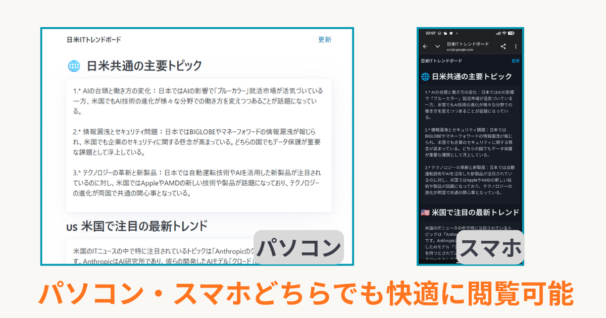

こんにちは、e-Shikumi-Laboのシンです。 このブログでは、スプレッドシート＆GASやChrome拡張機能をはじめとする、自動化のTipsを紹介しています。

前回までに、裏側でニュースを自動収集し（IMPORTFEED関数）、OpenAI APIとGASを使って画面を閉じている間も定期的に自動要約・整理する仕組みを作成しました。

今回は、この「日米ITトレンドボード」を一連の情報収集システムとして完結させるために、最終的な「出力（閲覧画面）」をブラッシュアップしていきます。

### 標準の「ウェブに公開」に残る不満

第1回では、作成したシートを外出先からスマホでチェックするために、スプレッドシート標準の「ウェブに公開」機能を利用しました。

手軽にURL化できるのは便利なのですが、スプレッドシートの表がそのまま無機質なHTMLとして出力されるため、いくつか不満が出てきます。特に画面の狭いスマホで見たときに、ニュースの長いタイトルやURLの表が横にはみ出してしまい、スクロールしながらでないと読めないという、レスポンシブ（スマホ対応）の面で実用性に欠ける状態でした。

### ウェブアプリ機能（Web Apps）でサイトを作る

そこで思い付いたのが、スプレッドシートのウェブアプリ機能です。ウェブアプリ機能とは、GASでWebページを作る機能のこと。サーバーを用意することなく、Webページを公開することができます。

公開自体は難しくありませんが、HTMLやCSSの知識が必要になります。とはいえ、私自身はHTMLやCSSのフロントエンド周りには詳しくありませんし、そこにあまり多くの時間をかけたくもありません。

そこで今回は、生成AI（ChatGPTやGemini）を壁打ち相手にして、「簡単にスマホ対応のシンプルな画面を作りたい」と相談してみました。

### AIからの提案：軽量フレームワーク「Pico.css」の採用

’AIに以下のようなニュアンスで相談を投げかけてみました。

> 「この『日米ITトレンドボード』をWeb Appsでニュースサイトとして公開したい。HTML・CSSの理解は浅いので複雑なことは避け、既存のテンプレートみたいなCSSに当てはめるくらいにしたい。最低限『見やすくなる』『スマホ対応（レスポンシブ対応）』ができる程度のシンプルなものを提案して」

そこでAIから提案されたのが、「Pico.css」という軽量CSSフレームワークでした。

初めて名前を聞いたので、最初は「何それ？美味しいの？」状態だったのですが、例として示されたコードをそのまま使ってウェブアプリをテスト公開してみたところ、綺麗な画面が出現しました。


 

スプレッドシート標準の「ウェブに公開」と比較しても、デザインの洗練さとスマホでの読みやすさは一目瞭然。今回はこの「Pico.css」を採用して進めることにしました。

### 表示部だからこそ割り切って任せる

今回、人間側がAIに伝えたのは、スプレッドシート内のどこに、どんなデータが入っているかという「データの場所（シート名やセルアドレス）」だけです。

これを伝えると、AIは裏側で動くGASプログラム（Code.gs）と、画面を表示するためのHTML（Index.html）を数秒で一気に出力してくれました。

もちろん、これがデータの書き換えや重要なロジックを伴う処理であれば、中身をブラックボックスにしたまま運用するのは仕組み化の観点からも危険です。しかし、今回はあくまで「すでに裏側で安全に完成しているデータを、画面に綺麗に映し出す」という、**表示と装飾（フロントエンド）のフェーズ**です。

だからこそ、私自身も出力されたHTMLやJavaScriptのコードを1行ずつ細かく解読することはせず、「見た目の構築はAIに丸投げする」という割り切ったアプローチを取りました。自分が注力すべき「仕組みの核（データの制御やセキュリティ）」にエネルギーを集中させ、苦手なフロントエンドのコード作成はAIに委ねて時間を最小限に抑える。これこそが、開発コストを最適化し、生成AIを現実的に「飼い慣らす」ためのスピード感です。

### 💡 AIがクリアしてくれた、スプレッドシート特有の「2つのポイント」

コードの全貌を理解する必要はありませんが、AIがスプレッドシート特有のデータ構造を綺麗に処理するために、プログラム内に仕込んでくれた「2つの重要なメソッド」があります。ここだけ知っておくと、今後の自動化にも応用が効くので共有します。

* **ポイント①：`getDisplayValue()` による日時の維持**
```javascript
  updatedAt: sheet.getRange("F1").getDisplayValue()
```

通常の `getValue()` で日付データをそのまま取得すると、GASの内部処理で英語の長い標準時データ（`Thu Jul 02 2026...`）に変換されてしまい、画面の表記が崩れてしまいます。`getDisplayValue()` を使うことで、スプレッドシートの画面上で見えている「2026/07/02 10:00」という文字列のまま一発でスマートに取得できます。

- **ポイント②：`getRichTextValues()` によるURLの抽出**
```javascript
  var jpRichTexts = sheet.getRange("B14:B23").getRichTextValues();
  var url = cellValue.getLinkUrl();
```
   
セル内に `=HYPERLINK("URL", "タイトル")` の関数が入っている場合、通常の `getValue()` では「タイトル」の文字列しか取得できず、肝心のリンク情報が消えてしまいます。`getRichTextValues()` を使ってセル内のリッチテキストオブジェクトを取得することで、テキストと埋め込まれたURLを個別に分離して抽出することができます。

こういったスプレッドシート特有の「お作法」や「罠」への対策も、AIにデータの状態を詳しく伝えるだけで自動的にコードに組み込んでくれるのが本当に頼もしいところです。

### 3. ウェブアプリとして公開する手順（デプロイ）

コードを配置したら、最後に見られる状態（URL化）にします。

1. GAS画面の右上にある **「デプロイ」** ボタンから **「新しいデプロイ」** をクリックします。
    
2. 種類の選択（歯車マーク）で **「ウェブアプリ」** を選択します。
    
3. 設定を以下のように指定します。
    
    - **次のユーザーとして実行：** `自分`（スプレッドシートの閲覧権限をWebアプリ側に持たせるため）
        
    - **アクセスできるユーザー：** `全員`（URLを知っている人のみ閲覧可能になります）
        
4. **「デプロイ」** ボタンを押し、初回のみアカウントへのアクセス承認（権限の許可）を完了させます。
    

これで発行された「ウェブアプリのURL」にアクセスすれば、レスポンシブ対応が施された自分専用のニュースダッシュボードが開きます。

#### ⚠️ セキュリティに関する再確認

第1回でも触れましたが、ウェブアプリのアクセス権限を「全員」にした場合、このURLが外部に漏れると誰でもデータを閲覧できる状態になります。個人情報や社外秘の重要データが含まれるスプレッドシートに対して同じ設定を行わないよう、運用の切り分けには十分注意してください。

### まとめ

自分が苦手とする領域であり、**仕組みの根幹（ロジック）には影響しないフロントエンドの表示・デザイン構築において**、AIを効率的な壁打ち相手として活用することで、必要最小限の労力で目的を達成するアプローチを取りました。「Pico.css」という要件に合致したツールを選定させ、データの場所を指示するだけでベースを仕上げられたため、開発時間を大幅に短縮できています。

これにより、

1. **入力：** 裏側で自動的にRSSフィードを取得し（第2回）
    
2. **処理：** 画面を閉じていてもOpenAI APIが定期的に自動要約し（第3回）
    
3. **出力：** スマホから専用URLで快適にトレンドを定点観測する（今回）
    

という、運用の手間が一切かからない一連の情報収集の「仕組み」が完結しました。

日常業務の中にある「毎日開いて確認する、転記する、整理する」といった小さな手間の自動化において、今回の連載が何かしらの参考になれば幸いです。